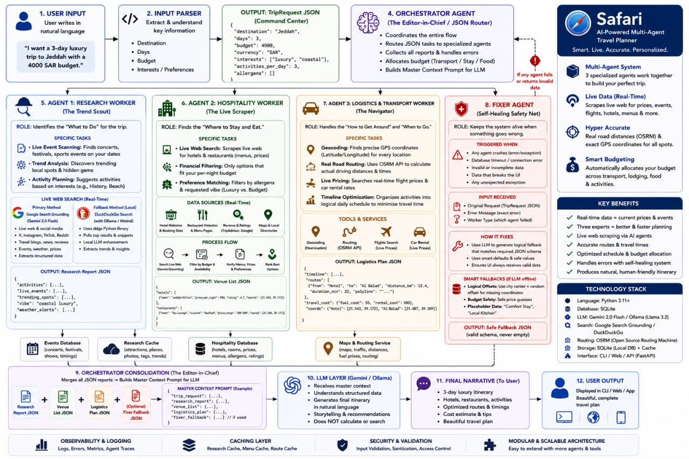

# 🧭 Safari — How It Works (Behind the Scenes)

> **Smart. Live. Accurate. Personalized.**
> A multi-agent AI travel planner that turns one sentence into a fully-priced, day-by-day itinerary.



---

## 📌 Overview

Safari is built on a **multi-agent architecture**. Instead of one giant LLM call trying to do everything, the work is split across three specialized **Worker Agents** coordinated by an **Orchestrator Agent**, with a **Fixer Agent** standing by as a self-healing safety net. Live data is scraped in real time, validated, cached, and finally turned into a natural-language itinerary.

The whole flow is summarized in 12 stages, mirrored exactly in the diagram above.

---

## 1. 🧑 User Input

The user writes a request in plain natural language — no forms, no dropdowns.

> *"I want a 3-day luxury trip to Jeddah with a 4000 SAR budget."*

Free-form text only. The user can mention destination, days, budget, vibe, allergies, interests, or activities — in any order.

---

## 2. 🧩 Input Parser

The parser extracts structured information from the message and produces a `TripRequest` JSON object — the **command center** of the run.

```json
{
  "destination": "Jeddah",
  "days": 3,
  "budget": 4000,
  "currency": "SAR",
  "interests": ["luxury", "coastal"],
  "activities_per_day": 3,
  "allergens": []
}
```

This object is the single source of truth that gets passed to every downstream agent.

---

## 3. 🧠 Orchestrator Agent (Editor-in-Chief)

The Orchestrator is the JSON router and traffic controller. It does **not** generate prose — it coordinates.

Responsibilities:
- Coordinates the entire flow
- Routes JSON tasks to the right specialized agent
- Collects every worker's report and handles errors
- Allocates budget across Transport / Stay / Food / Activities
- Builds the **Master Context Prompt** that the final LLM consumes

If any worker crashes, returns invalid data, or times out, the Orchestrator automatically calls the **Fixer Agent** (stage 8).

---

## 4. 🕵️ Agent 1 — Research Worker (*The Trend Scout*)

**Role:** Identifies the *"What to Do"* for the trip.

Specific tasks:
- 🎟️ **Live Event Scanning** — concerts, festivals, sports events on the user's dates
- 📈 **Trend Analysis** — discovers trending local spots and hidden gems
- 🧭 **Activity Planning** — suggests activities that match interests (luxury, coastal, history, beach…)

**Live web search:**
- **Primary:** Google Search Grounding (Gemini 2.0 Flash) — live web + social signals (X, Instagram, TikTok, Reddit), travel blogs, news, reviews, events, weather, prices
- **Fallback (offline):** DuckDuckGo via the `ddgs` Python library + local LLM (Ollama / Mistral) to extract trends and insights

**Output: Research Report JSON**
```json
{
  "activities": [...],
  "live_events": [...],
  "trending_spots": [...],
  "vibe": "coastal luxury",
  "weather_alerts": [...]
}
```

---

## 5. 🏨 Agent 2 — Hospitality Worker (*The Live Scraper*)

**Role:** Finds the *"Where to Stay and Eat"*.

Specific tasks:
- **Live Web Search** — scrapes the live web for hotels and restaurants (menus, prices)
- **Financial Filtering** — keeps only options that fit the per-night sub-budget
- **Preference Filtering** — filters by allergens and the requested vibe (luxury vs. budget)

**Data sources (real-time):** hotel websites & booking sites, restaurant sites & menu pages, reviews & ratings (TripAdvisor, Google), maps & local directories.

**Process flow:** Search Live Web (Gemini grounding) → Filter by Budget & Availability → Verify Menus, Prices & Allergens → Rank Best Options.

**Output: Venue List JSON**
```json
{
  "hotels": [
    {"name": "Jeddah Hilton", "price_per_night": 980, "rating": 4.7, "coords": [21.543, 39.172]}
  ],
  "restaurants": [
    {"name": "Sky Lounge", "cuisine": "Seafood", "price_range": "200-300", "coords": [21.544, 39.171]}
  ]
}
```

---

## 6. 🚗 Agent 3 — Logistics & Transport Worker (*The Navigator*)

**Role:** Handles the *"How to Get Around"* and *"When to Go"*.

Specific tasks:
- 📍 **Geocoding** — precise GPS coordinates for every location (Nominatim)
- 🛣️ **Real Road Routing** — actual driving distances/times via the OSRM API
- ✈️ **Live Pricing** — real-time flight prices and car-rental rates (Almosafer + partners)
- ⏱️ **Timeline Optimization** — orders activities into a logical daily schedule that minimizes travel time

**Tools & services:** Geocoding (Nominatim), Routing (OSRM API), Flights Search (live), Car Rental (live).

**Output: Logistics Plan JSON**
```json
{
  "timeline": [...],
  "routes": [
    {"from": "Hotel", "to": "Al Balad", "distance_km": 12.4, "duration_min": 22, "polyline": "..."}
  ],
  "travel_cost": {"fuel_cost": 55, "rental_cost": 180},
  "coords": {"Hotel": [21.543, 39.172], "Al Balad": [21.487, 39.189]}
}
```

---

## 7. 🛡️ Fixer Agent (Self-Healing Safety Net)

**Role:** Keeps the system alive when something goes wrong.

**Triggered when:** any agent crashes (exception), database/connection timeout, invalid or incomplete data, data that would break the UI, or any unexpected exception.

**Input received:** the original `TripRequest`, the error message, and which worker failed.

**How it fixes:**
- Uses the LLM to generate a logical fallback that **matches the required JSON schema**
- Uses smart defaults and safe values
- Guarantees the LLM always receives valid, non-empty data

**Smart fallbacks (works fully offline too):**
- 🧭 **Logical offsets** — uses the city center + a small random offset for missing coordinates
- 💰 **Budget safety** — safe price guesses inside the user's allocation
- 🏷️ **Placeholder data** — generic but coherent (e.g. *"Comfort Stay"*, *"Local Kitchen"*)

**Output: Safe Fallback JSON** — valid schema, never empty.

---

## 8. 🗃️ Storage & Routing Layer

Behind the scenes, several stores and services keep things fast and consistent:

- **Events Database** — festivals, shows, timings
- **Research Cache** — attractions, photos, tags, trends
- **Hospitality Database** — rooms, prices, menus, allergens, ratings
- **Maps & Routing Service** — maps, traffic, distances, fuel prices, routing

This is what makes repeated planning fast and what allows graceful degradation when a live source is down.

---

## 9. 📑 Orchestrator Consolidation

The Orchestrator merges every report into one **Master Context Prompt** for the LLM.

```
Research Report JSON  +  Venue List JSON  +  Logistics Plan JSON  +  (optional) Fixer Fallback JSON
                                       │
                                       ▼
                              MASTER CONTEXT PROMPT
{
  "trip_request":   {...},
  "research_report":{...},
  "venue_list":     {...},
  "logistics_plan": {...},
  "fixer_fallback": {...}   // only if used
}
```

---

## 10. 🤖 LLM Layer (Gemini / Ollama)

The LLM receives the master context and:
- Understands the structured data
- Generates the final itinerary in natural language
- Adds storytelling and recommendations
- **Does NOT** calculate or search — all of that already happened upstream

This separation is intentional: the LLM is a writer, not a researcher. It can't hallucinate prices, distances, or hotels because they were all pinned by the workers before it ever saw the prompt.

---

## 11. 💬 Final Narrative

The output the user actually reads:
- 3-day luxury itinerary
- Hotels, restaurants, activities
- Optimized routes & timings
- Cost estimate & tips
- A clean, beautiful travel plan

---

## 12. 📺 User Output

Displayed in the CLI, web app, or API response — the same plan, three surfaces.

---

## 🧱 Cross-Cutting Concerns

| Concern | What we do |
|---|---|
| **Observability & Logging** | Logs, errors, metrics, agent traces for every run |
| **Caching Layer** | Research cache, menu cache, route cache |
| **Security & Validation** | Input validation, sanitization, access control |
| **Modular Architecture** | Easy to add more agents and tools without touching the orchestrator's contract |

---

## 🛠️ Technology Stack

- **Language:** Python 3.11+
- **Database:** SQLite
- **LLM:** Gemini 2.0 Flash (cloud) / Ollama + Llama 3.2 (local fallback)
- **Search:** Google Search Grounding / DuckDuckGo
- **Routing:** OSRM (Open Source Routing Machine)
- **Storage:** SQLite (local DB) + cache
- **Interface:** CLI / Web / API (FastAPI)

---

## ✅ Key Benefits

- Real-time data — current prices and events
- Three experts > one generalist (better and faster planning)
- Live web scraping via AI agents
- Accurate, real road distances and travel times
- Optimized schedule and budget allocation
- Self-healing system handles errors gracefully
- Produces natural, human-friendly itineraries

---

## 🔁 End-to-End Trace (One Request)

```
User sentence
   │
   ▼
Input Parser ──► TripRequest JSON
   │
   ▼
Orchestrator ──► routes in parallel:
   ├─► Research Worker     → Research Report JSON
   ├─► Hospitality Worker  → Venue List JSON
   └─► Transport Worker    → Logistics Plan JSON
                │
                ▼
   (any failure?) ─► Fixer Agent ─► Safe Fallback JSON
                │
                ▼
Orchestrator Consolidation ──► Master Context Prompt
                │
                ▼
            LLM Layer ──► Final Narrative ──► User
```

That's the whole story — from one sentence to a fully-priced, fully-routed, fully-personalized trip.
